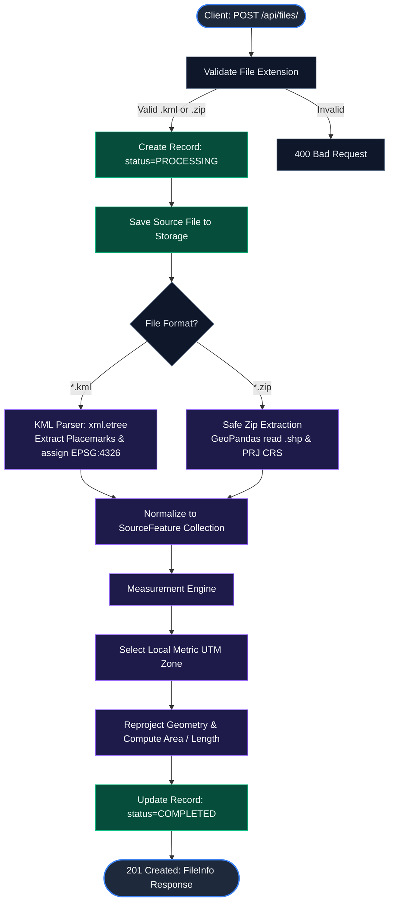
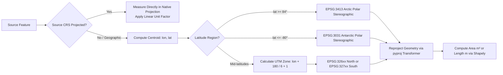

# <p align="center">🌍 Geospatial File Measurement API</p>

<p align="center">
  <strong>A high-performance, production-ready FastAPI service for geospatial file ingestion, CRS transformation, and precision metric calculations.</strong>
</p>

<p align="center">
  <a href="https://www.python.org/"></a>
  <a href="https://fastapi.tiangolo.com/"></a>
  <a href="https://geopandas.org/"></a>
  <a href="https://shapely.readthedocs.io/"></a>
  <a href="https://pyproj4.github.io/pyproj/"></a>
  
  <a href="https://github.com/aksharagupta082007/Geospatial-File-Measurement-API-/blob/main/LICENSE"></a>
</p>

<p align="center">
  <a href="#-key-features">Key Features</a> •
  <a href="#-quick-start">Quick Start</a> •
  <a href="#-api-documentation">API Documentation</a> •
  <a href="#-architecture--workflow">Architecture</a> •
  <a href="#-crs-handling-strategy">CRS Strategy</a> •
  <a href="#-design-decisions">Design Decisions</a> •
  <a href="#-future-scope">Future Scope</a>
</p>

---

## ✨ Key Features

- 📂 **Multi-Format Ingestion**: Native support for `.kml` files and `.zip` archives containing ESRI Shapefiles (`.shp`, `.dbf`, `.prj`).
- 📐 **Precision Metric Measurements**:
  - **Polygons / MultiPolygons** → Surface Area in square meters (m²).
  - **LineStrings / MultiLineStrings** → Length in meters (m).
  - **Points / MultiPoints** → Gracefully marked as `NOT_APPLICABLE` (no measurement required).
- 🌐 **Automated CRS Reprojection**: Converts geographic coordinate systems (e.g. `EPSG:4326` in decimal degrees) into local metric **UTM zones** based on geometry centroids before computing measurements.
- 🛡️ **Fault-Tolerant Geometry Handling**: Empty, invalid, or unsupported geometry types return descriptive `UNSUPPORTED` payloads instead of crashing the API.
- 🔒 **Security Hardened**: Path-traversal validation prevents Zip Slip vulnerabilities during archive unpacking.
- 💾 **Persistent Metadata Storage**: Atomic JSON file store with explicit state transitions (`PROCESSING`, `COMPLETED`, `FAILED`).
- ⚡ **Interactive Documentation**: Auto-generated Swagger UI and ReDoc accessible out of the box.

---

## 🚀 Quick Start

### Prerequisites
- **Python 3.11+** installed
- `pip` package manager

### 1. Clone & Setup Environment

```bash
git clone https://github.com/aksharagupta082007/Geospatial-File-Measurement-API-.git
cd Geospatial-File-Measurement-API-

# Create virtual environment
python -m venv .venv

# Activate virtual environment
# Windows (PowerShell):
.venv\Scripts\Activate.ps1
# Windows (CMD):
.venv\Scripts\activate.bat
# Linux / macOS:
source .venv/bin/activate

# Install dependencies
pip install -r requirements.txt
```

### 2. Configure Environment (Optional)

Customize settings via environment variables:

| Variable | Default | Description |
| :--- | :--- | :--- |
| `GEOSPATIAL_DATA_DIR` | `data` | Directory where uploads and `files.json` reside |
| `GEOSPATIAL_MAX_UPLOAD_BYTES` | `104857600` (100 MB) | Maximum upload file size threshold |

### 3. Launch the Server

```bash
uvicorn app.main:app --reload
```

Server running at **`http://127.0.0.1:8000`** 🚀

| Interface | URL | Purpose |
| :--- | :--- | :--- |
| **Interactive Docs (Swagger UI)** | [http://127.0.0.1:8000/docs](http://127.0.0.1:8000/docs) | Interactive API testing playground |
| **Alternative Docs (ReDoc)** | [http://127.0.0.1:8000/redoc](http://127.0.0.1:8000/redoc) | Clean, searchable reference docs |
| **Health Probe** | [http://127.0.0.1:8000/healthz](http://127.0.0.1:8000/healthz) | Liveness & uptime probe |

---

## 🧪 Running Automated Tests

Run the unit and integration tests using Python's built-in `unittest` runner:

```bash
python -m unittest discover -s tests -v
```

```text
test_kml_upload_file_info_and_measurements (test_api.ApiTests.test_kml_upload_file_info_and_measurements) ... ok
test_rejects_unsupported_file_type (test_api.ApiTests.test_rejects_unsupported_file_type) ... ok
test_zipped_shapefile_upload (test_api.ApiTests.test_zipped_shapefile_upload) ... ok

----------------------------------------------------------------------
Ran 3 tests in 0.514s

OK
```

> [!NOTE]
> Tests run inside dedicated isolated temporary folders (`.test-tmp/`) and do not pollute the primary `data/` directory.

---

## 📡 API Documentation

### 1. Upload Geospatial File

<kbd>POST</kbd> `/api/files/`

Uploads and immediately processes a `.kml` file or `.zip` containing a Shapefile.

#### Request Headers & Body
- **Content-Type**: `multipart/form-data`
- **Body Parameter**: `file` (Binary file content)

#### cURL Examples

```bash
# Uploading a KML file
curl -X POST "http://127.0.0.1:8000/api/files/" \
  -F "file=@survey.kml"

# Uploading a zipped Shapefile
curl -X POST "http://127.0.0.1:8000/api/files/" \
  -F "file=@parcels.zip"
```

#### Response (`201 Created`)
```json
{
  "id": "e4b54c8fbd2e1234abcda3f9c1d25678",
  "filename": "survey.kml",
  "feature_count": 3,
  "crs": "EPSG:4326",
  "status": "COMPLETED",
  "uploaded_at": "2026-10-08T10:00:00.000000Z",
  "error": null
}
```

| HTTP Status | Description |
| :--- | :--- |
| `201 Created` | File accepted, parsed, reprojected, and measured |
| `400 Bad Request` | Unsupported file extension, invalid XML/Shapefile, or zero features |
| `413 Payload Too Large` | File exceeds maximum upload limit (`GEOSPATIAL_MAX_UPLOAD_BYTES`) |

---

### 2. Get File Information

<kbd>GET</kbd> `/api/files/{id}/`

Retrieves processing metadata, feature counts, CRS, and lifecycle status for a given file ID.

#### cURL Example
```bash
curl "http://127.0.0.1:8000/api/files/e4b54c8fbd2e1234abcda3f9c1d25678/"
```

#### Response (`200 OK`)
```json
{
  "id": "e4b54c8fbd2e1234abcda3f9c1d25678",
  "filename": "survey.kml",
  "feature_count": 3,
  "crs": "EPSG:4326",
  "status": "COMPLETED",
  "uploaded_at": "2026-10-08T10:00:00.000000Z",
  "error": null
}
```

| HTTP Status | Description |
| :--- | :--- |
| `200 OK` | File metadata successfully retrieved |
| `404 Not Found` | Requested file ID does not exist |

---

### 3. Get Geometry Measurements

<kbd>GET</kbd> `/api/files/{id}/measurements/`

Returns detailed measurement calculations, projected metric coordinate reference system (CRS), and properties for every feature in the dataset.

#### cURL Example
```bash
curl "http://127.0.0.1:8000/api/files/e4b54c8fbd2e1234abcda3f9c1d25678/measurements/"
```

#### Response (`200 OK`)
```json
{
  "file_id": "e4b54c8fbd2e1234abcda3f9c1d25678",
  "measurements": [
    {
      "feature_id": "control-point-1",
      "feature_index": 0,
      "geometry_type": "Point",
      "geometry": {
        "type": "Point",
        "coordinates": [-73.9857, 40.7484]
      },
      "crs": "EPSG:4326",
      "properties": {
        "name": "Control Point 1"
      },
      "area_sq_m": null,
      "length_m": null,
      "projected_crs": null,
      "status": "NOT_APPLICABLE",
      "message": "Point geometries do not require measurement."
    },
    {
      "feature_id": "survey-transect-2",
      "feature_index": 1,
      "geometry_type": "LineString",
      "geometry": {
        "type": "LineString",
        "coordinates": [
          [-73.9857, 40.7484],
          [-73.9851, 40.7489]
        ]
      },
      "crs": "EPSG:4326",
      "properties": {
        "name": "Transect A"
      },
      "area_sq_m": null,
      "length_m": 75.421,
      "projected_crs": "EPSG:32618",
      "status": "MEASURED",
      "message": null
    },
    {
      "feature_id": "parcel-polygon-3",
      "feature_index": 2,
      "geometry_type": "Polygon",
      "geometry": {
        "type": "Polygon",
        "coordinates": [
          [
            [-73.9860, 40.7480],
            [-73.9850, 40.7480],
            [-73.9850, 40.7490],
            [-73.9860, 40.7490],
            [-73.9860, 40.7480]
          ]
        ]
      },
      "crs": "EPSG:4326",
      "properties": {
        "name": "Parcel 101",
        "owner": "Ada Lovelace"
      },
      "area_sq_m": 8645.231,
      "length_m": null,
      "projected_crs": "EPSG:32618",
      "status": "MEASURED",
      "message": null
    }
  ]
}
```

#### Status Behavior Matrix

| Measurement Status | Meaning | Applied To |
| :--- | :--- | :--- |
| `MEASURED` | Reprojected to local metric UTM; area or length computed in meters | `Polygon`, `MultiPolygon`, `LineString`, `MultiLineString` |
| `NOT_APPLICABLE` | Measurement intentionally omitted per problem specification | `Point`, `MultiPoint` |
| `UNSUPPORTED` | Empty geometry, unresolvable CRS, or unhandled geometry type | `GeometryCollection`, empty geometries, missing CRS |

---

### 4. Health Check

<kbd>GET</kbd> `/healthz`

Service readiness probe for container orchestrators and load balancers.

```bash
curl http://127.0.0.1:8000/healthz
# {"status":"ok"}
```

---

## 🏗️ Architecture & Workflow

### Directory Layout

```text
geospatial-fastapi-api/
├── app/
│   ├── config.py              # Application settings & environment configurations
│   ├── domain.py              # Pure Python domain entities (SourceFeature, ProcessedDataset)
│   ├── main.py                # FastAPI factory, endpoints, and route controllers
│   ├── schemas.py             # Pydantic request/response schemas
│   └── services/
│       ├── errors.py          # Domain-level UserInputError exceptions
│       ├── kml.py             # Pure-Python KML XML parser (no GDAL binary dependency)
│       ├── measurements.py    # Reprojection and geometric measurement engine
│       ├── processing.py      # Archive extraction & format dispatcher
│       └── storage.py         # FileStore: Disk writer & atomic JSON persistence
├── tests/
│   └── test_api.py            # Comprehensive test coverage (KML, Shapefile, Validation)
├── data/                      # Local data directory (auto-created, gitignored)
│   ├── files.json             # Atomic JSON database
│   └── uploads/               # Uploads directory grouped by file ID
├── requirements.txt           # Production dependencies
└── README.md
```

### End-to-End Processing Pipeline



---

## 🗺️ CRS Handling Strategy

> [!IMPORTANT]
> **Why we NEVER compute measurements in degrees (`EPSG:4326`):**
> Geographic coordinates represent angular distances on an ellipsoid. While 1 degree of latitude is roughly 111 km, 1 degree of longitude shrinks towards zero at the poles. Performing cartesian measurements on geographic degrees yields square degrees or degree lengths, which are physically meaningless and distorted.



### Projection Mechanics
1. **Centroid Extraction**: Calculate the centroid `(lon, lat)` of the geometry in WGS 84.
2. **Dynamic UTM Zone Selection**:
   - `Zone = floor((lon + 180) / 6) + 1`
   - Northern Hemisphere (`lat >= 0`): `EPSG:32600 + Zone`
   - Southern Hemisphere (`lat < 0`): `EPSG:32700 + Zone`
3. **Polar Edge Cases**: For geometries at extreme polar regions (`>= 84° N` or `<= -80° S`), the engine safely switches to **EPSG:3413** (NSIDC Sea Ice Polar Stereographic North) or **EPSG:3031** (Antarctic Polar Stereographic).
4. **Coordinate Reprojection**: Transformation is handled by `pyproj.Transformer` with `always_xy=True`, ensuring standard `(x, y)` coordinate ordering.

---

## 💡 Design Decisions

| Decision | Rationale | Alternatives Considered |
| :--- | :--- | :--- |
| **FastAPI Framework** | High performance, native asynchronous capability, and automatic OpenAPI schema generation with zero boilerplate. | Django REST Framework (added ORM and migration overhead unneeded for an API-only service). |
| **Custom Pure-Python KML Parser** | Built on Python's native `xml.etree.ElementTree`. Completely avoids fragile binary C-extensions and GDAL installation issues on Windows/macOS. | GDAL / Fiona KML Driver (requires complex OS-level GDAL binaries). |
| **Atomic JSON FileStore** | Writes database records to a `.tmp` file before renaming (`shutil.move`), eliminating partial write corruption during server crashes. | Relational DB (added local setup complexity without requirement). |
| **Per-Feature UTM Projection** | Selecting UTM zones on a per-geometry basis guarantees minimal scale distortion for datasets spanning UTM borders. | Single global projection (high distortion away from the projection center). |
| **Zip Slip Defense** | Resolves destination paths and validates prefix before extraction to defend against arbitrary path traversal attacks. | Default `ZipFile.extractall()` without path checks. |

---

## 📚 Key Learnings

1. **Geospatial Measurement is a CRS Problem**: Accurately measuring geography requires understanding map projections and ellipsoidal distortions. Reprojecting to an appropriate conformal projection (like UTM) is fundamental for accurate metric calculations.
2. **KML XML Namespace Gotchas**: KML specifications often enclose elements in default XML namespaces (`xmlns="http://www.opengis.net/kml/2.2"`). Stripping namespaces before tag comparison is essential for robust, vendor-agnostic XML parsing.
3. **Defensive Geometry Processing**: Real-world geospatial files frequently contain degenerate geometries, unclosed rings, or missing projection sidecars. Defensive handling with informative statuses (`NOT_APPLICABLE`, `UNSUPPORTED`) provides resilience.

---

## 🔮 Future Scope

- [ ] **Asynchronous Background Processing**: Offload large file processing to Celery or ARQ with Redis, returning `202 Accepted` immediately.
- [ ] **PostgreSQL + PostGIS Integration**: Migrate from JSON flat files to PostGIS for spatial queries, indexing (`GIST`), and topological verification.
- [ ] **Additional Format Support**: Add native parsing for GeoJSON, GeoPackage (`.gpkg`), and cloud-optimized FlatGeobuf (`.fgb`).
- [ ] **Multi-Zone Equal-Area Strategy**: Implement global equal-area reprojections (e.g. Albers Equal Area or Mollweide) for features that span across multiple UTM zones.
- [ ] **Authentication & Rate Limiting**: Implement API Key or JWT authentication with rate limits to prevent resource exhaustion.
- [ ] **Containerization & CI/CD**: Provide `Dockerfile`, `docker-compose.yml`, and GitHub Actions workflow for automated testing and deployment.

---

<p align="center">
  Built with ❤️ for precision geospatial computing.
</p>
